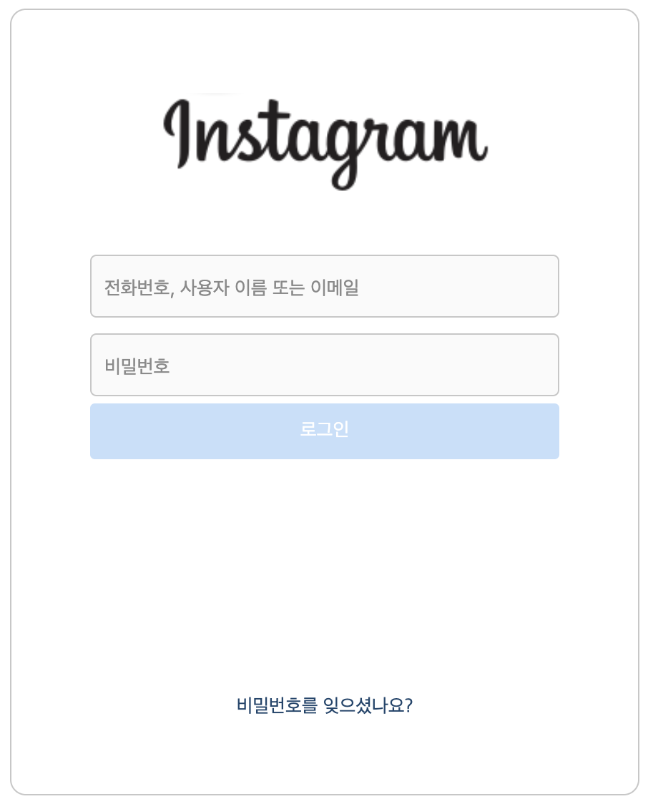
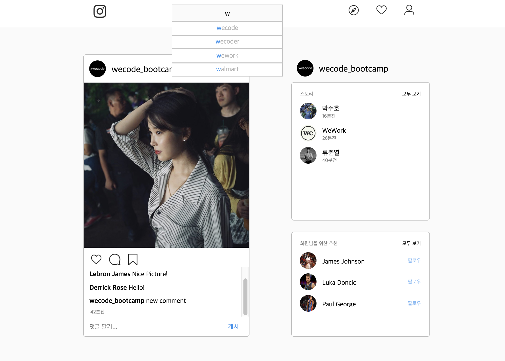

# Instagram CloneCoding with React

인스타그램의 로그인 페이지와 메인 페이지 하나씩, react-create-app 으로 만들었다. Function 대신 Class만을 이용했으며 css는 sass를 이용했다. 각 페이지마다 사진 한장과 주요하게 작용한 코드를 공유할 것이다.

### Login Page

#### 개요

- 위와 같이 인스타그램의 로그인 페이지 중, 아이디와 비밀번호를 클릭하는 부분을 따로 떼어 클론 코딩하였다.

- 백엔드(참고로 백엔드는 장고를 이용해 endpoint를 만들었다)에 미리 지정해둔 계정의 사용자 이름, 전화번호 또는 이메일 주소를 입력하고 알맞은 비밀번호를 입력하면 메인 페이지로 이동할 수 있다.

- 만약 아이디를 입력했다가 다시 지웠을 경우, 경고 메시지가 뜰 것이고 잘못된 아이디 혹은 비밀번호를 입력하면 페이지는 Reload 된다.



```js
class IdPwForm extends Component {
  constructor() {
    super();
    this.state = {
      placeholder: { id: "전화번호, 사용자 이름 또는 이메일", pw: "비밀번호" },
      type: { id: "text", pw: "password" },
      idActive: false,
      pwActive: false,
      warning: false,
      idValue: "",
      pwValue: ""
    };
  }
```

class 내에서 state는 다음과 같이 관리할 수 있다. state는 component 내에서 보관할 수 있는 일종의 상태 값이며 수정이 가능하다. 예를 들어, 위의 `placeholder, type` 이라는 key는 특별한 경우가 아닌 이상 변동 사항이 거의 없다. 그러나 `idActive, pwActive, warning, idValue, pwValue`와 같은 상태 값들은 변동이 필요한 것들이다.

```js
idActivate = state => {
  state
    ? this.setState({ idActive: true }, () => {
        const { makeWarning } = this;
        makeWarning();
      })
    : this.setState({ idActive: false }, () => {
        const { makeWarning } = this;
        makeWarning();
      });
};
```

idActivate는 id를 입력한 뒤 다시 지웠을 경우, id를 입력해야한다는 경고를 밑에 생성하는 메서드이다. 위처럼 `Boolean ? ifTrue : ifFalse` 와 같은 삼항 연산을 이용하면 간결하게 표현할 수 있다.

```js
updateInputVal = (name, textValue) => {
  this.setState({
    [name]: textValue
  });
};
```

input의 value는 항상 조심스럽게 다뤄야 한다.  
왜냐하면 사용자는 정확한 값을 입력했는데 네트워크나 기타 오류로 인해 백엔드 서버에 제대로 전달되지 않을 경우, 서버는 부정확한 값이라고 인식하게 되고, 서비스에 큰 차질로 이어질 수 있기 때문이다.  
그래서 local storage와 같은 브라우저의 데이터 베이스에 업데이트한 뒤, 그 값을 사용자에게 보여주는 방식으로 input의 value를 관리해야 한다.

이번 Instagram 클론 코딩에서는 local storage를 이용하지는 않았고, 미리 import 해둔 데이터 파일의 값과 id, pw가 일치할 경우 main 페이지로 넘어갈 수 있도록 했다.

```js
goToMain = () => {
  const { idValue, pwValue } = this.state;
  const { history } = this.props;
  LoginData.forEach(user => {
    Object.values(user).includes(idValue) &&
    Object.values(user).includes(pwValue)
      ? history.push("/main")
      : window.location.reload();
  });
};
```

### Main Page

#### 개요

- 메인 페이지는 하나의 포스트만을 만들었다. 하지만 모두 별개의 component로써 존재하기 때문에 데이터 값을 받는대로 모두 출력할 수 있도록 만들었다.

- 메인 페이지에는 크게 두 가지의 기능을 넣었다. 첫번째는 댓글을 입력하는 기능, 두번째는 페이지 상단의 search에 값을 입력하면 알맞은 검색어를 찾아 위에서부터 배치해주고, 일치하는 글자의 색이 진해지는 기능이다.



```js
getSearchList = list => {
  const inputVal = this.props.inputVal;
  let matched = [];
  let unMatched = [];
```

getSearchList라는 함수에 list를 argument로 받아서 일치, 불일치하는 단어로 나누어 렌더링 될 수 있도록 만들었다.

```js
  for (let i = 0; i < list.length; i++) {
    list[i].startsWith(inputVal)
      ? matched.push(list[i])
      : unMatched.push(list[i]);
  }
  return matched.map((el, i) => {
    let matchedEl;
    let unMatchedEl;
```

map 메서드를 사용하면 <Li> 와 같은 연속된 테그를 렌더해야할 때 유용하게 사용이 가능하다. React에서 <li>를 이용해 렌더할 경우 key 값을 갖도록 유도한다.

```js
    if (el.startsWith(inputVal)) {
      matchedEl = el.slice(0, inputVal.length);
      unMatchedEl = el.slice(inputVal.length);
    } else {
      unMatchedEl = el;
    }
    return (
      <li key={i}>
        <span className="inputMatch">{matchedEl}</span>
        {unMatchedEl}
      </li>
    );
  });
};
```

백엔드에서 데이터를 받을 경우 해당 id를 넣어주면 된다. 하지만 추천 검색어는 데이터 베이스에서 받지 않았기 뗴문에 미리 하드코딩해둔 데이터의 인덱스를 순서대로 넣어주었다.  
onChange property를 이용해 input 박스에 변화가 생길 때마다 색이 바뀌는 것을 볼 수 있다.
